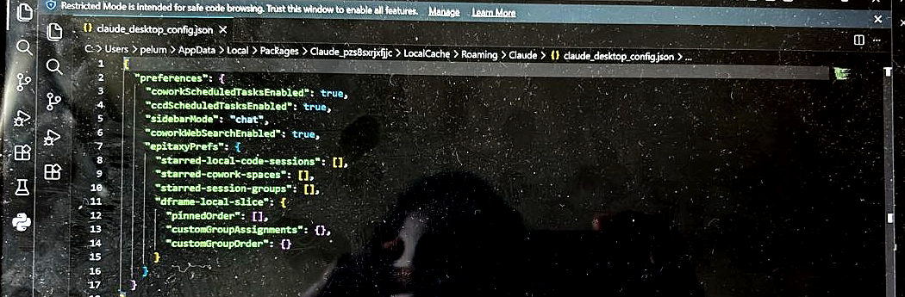
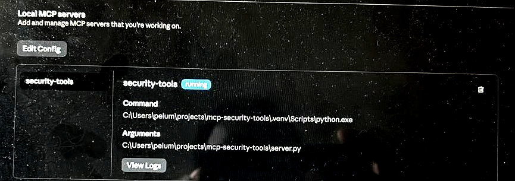

# MCP Security Tools — Build Log

A working notebook for building a Model Context Protocol server that exposes
security-relevant tools to an AI agent. This document is updated as the project
progresses — challenges, solutions, decisions, and the reasoning behind them.

**Author:** Lumi (plumi-cyber)
**Started:** May 9, 2026
**Target completion:** May 10, 2026 (two evenings)
**Repo:** `mcp-security-tools` (to be pushed to GitHub on evening two)

---

## Why this project exists

PointClickCare is hiring for a security analyst role on an "agentic AI-augmented
SOC platform." That phrase translates to: AI agents that call security tools
(SIEM queries, threat intel lookups, endpoint actions) through a protocol layer.

The hiring signal in that posting is that they want someone who understands how
AI assistants and security tools talk to each other — not someone who has just
read about it. A working public artifact that demonstrates this pattern closes
the credibility gap on the application.

The same artifact is reusable across any AI-forward security role going forward.

## Scope

Two tools, exposed via one MCP server, callable by Claude Desktop:

1. **Auth log parser** — reads a sample SSH auth log file, returns failed login
   attempts grouped by source IP.
2. **IP reputation check** — queries AbuseIPDB's free API to check if an IP has
   been reported as malicious.

The agent demo: feed it a fake auth log, ask it to find suspicious IPs and
check whether they're known bad actors. End-to-end agentic security workflow,
under 200 lines of code, no live infrastructure.

## Architecture from first principles

### What MCP is

**Model Context Protocol.** A standard format for how AI assistants call
external tools. Anthropic published it openly so any model and any tool can
talk to each other without bespoke glue code each time.

Mental model: imagine Claude as a brilliant analyst working in a sealed room.
On their own, they can think and write but can't reach out and check anything
in the real world — no database queries, no file reads, no API calls. To fix
that, you slide tools through a slot in the wall. Each tool is a function:
"look up this IP," "read that log file," "send this email." The analyst sees
a list of available tools, picks one, slides a request through, and gets a
result back.

MCP is the agreed-upon shape of that slot.

### MCP server vs. client

- An **MCP server** is the thing on the tool side of the slot. A program that
  says "here are the tools I expose, here are their inputs and outputs, and
  here's the code that runs when you call them."
- An **MCP client** is the thing on the AI side. Claude Desktop is an MCP
  client — when it starts, it reads its config, launches each registered MCP
  server as a subprocess, asks "what tools do you have?", and makes those
  tools available to the AI inside the chat.

These are entirely decoupled. My server doesn't know or care that it's Claude
on the other end — it would work identically with any MCP client. Claude
Desktop doesn't know or care what my server does internally — it just sees a
list of tools with descriptions and schemas.

That decoupling is why this pattern matters in security. PointClickCare's
"agentic SOC platform" works this way: one AI brain, dozens of tools (SIEM,
EDR, ticketing, threat intel) all behind the same protocol. The brain doesn't
need a custom integration for each.

### What an SDK is, and why we use one

**Software Development Kit.** A bundle of pre-built code someone hands you so
you don't have to build the basics from scratch.

Pharmacy analogy: when compounding a prescription, you didn't synthesize the
active ingredient from raw chemicals. You opened a jar of pre-manufactured
API powder, weighed it out, and combined it with a base. The hard chemistry
was already done. SDKs work the same way — the hard infrastructure is
pre-built; you focus on the application-specific work.

The MCP protocol itself involves message schemas, lifecycle events, transport
handshakes. Implementing it directly would be tedious. The official MCP Python
SDK (the `mcp` package on PyPI) exposes a high-level helper class called
**FastMCP** that hides all of it. I write normal Python functions and slap
`@mcp.tool()` on top. The helper inspects each function — reads the type hints,
reads the docstring — and generates the protocol-level schema automatically.

Result: an 8-line `server.py` that does what would otherwise be hundreds of
lines of protocol code.

---

## Evening 1 — Build Log

**Goal:** environment fully set up; a "hello world" MCP server that Claude
Desktop can see and call. Nothing more.

**Time spent:** ~3 hours (most of it on a Microsoft-Store sandbox issue that
had nothing to do with the code itself).

### Phase 1 — Install the four tools

| Tool | Version | Why |
|---|---|---|
| Python | 3.14 (x64) | Runtime for the MCP server. 3.14 has wheels available for all dependencies. |
| Git for Windows | latest x64 | Version control. The CPU architecture is determined by `$env:PROCESSOR_ARCHITECTURE`. |
| VS Code | latest | Editor with Python extension. |
| Claude Desktop | 1.6608.2 | The MCP client that will load and call my server. |

**Git installer choices that mattered:**

- **PATH option:** middle option ("Git from the command line and also from 3rd-party software"). The first option only enables Git in Git Bash; the third pollutes PATH with the entire Unix toolset.
- **SSH:** bundled OpenSSH (self-contained, no PATH conflicts).
- **HTTPS backend:** OpenSSL (portable across machines and environments; matches every tutorial online).
- **Line endings:** "Checkout as-is, commit Unix-style line endings." Linux/macOS/GitHub all use LF; auto-conversion creates phantom diffs and breaks shell scripts.
- **Credential helper:** Git Credential Manager. Handles GitHub OAuth automatically — no manual personal access token management.
- **Default branch:** `main` (modern convention; what every tutorial assumes).

**Challenge encountered:** after the Git install, `git --version` in PowerShell returned "not recognized." Cause: PowerShell loads PATH on startup; new programs don't appear in already-running shells. **Fix:** close and reopen PowerShell. Same issue later with the `code` command for VS Code, same fix.

### Phase 2 — Project skeleton + hello-world server

**Project structure:**
```
C:\Users\pelum\projects\mcp-security-tools\
├── .venv\                    # virtual environment (Python + packages)
├── server.py                 # the MCP server itself
└── (more files coming evening 2)
```

**Virtual environment.** Created with `python -m venv .venv` and activated with
`.\.venv\Scripts\Activate.ps1`. Mental model: a sealed lunchbox. Packages
installed into the .venv stay in the .venv, not on the system Python. When
`(.venv)` shows in the PowerShell prompt, I'm working inside it.

**Challenge encountered:** activating the venv failed with "running scripts is
disabled on this system" — PowerShell's default execution policy blocks local
scripts. **Fix (one-time):**
```powershell
Set-ExecutionPolicy -Scope CurrentUser -ExecutionPolicy RemoteSigned
```
Scoped to my user only, which is the standard developer setting on Windows.

**Packages installed:**
```powershell
pip install "mcp[cli]" requests python-dotenv
```
- `mcp[cli]` — the official Anthropic SDK plus its CLI tools.
- `requests` — for the AbuseIPDB HTTP call (evening 2).
- `python-dotenv` — loads the AbuseIPDB API key from a `.env` file instead of hardcoding it.

**The hello-world server (`server.py`):**

```python
from mcp.server.fastmcp import FastMCP

mcp = FastMCP("security-tools")

@mcp.tool()
def hello(name: str) -> str:
    """Says hello to confirm the MCP server is wired up."""
    return f"Hello from your MCP security-tools server, {name}!"

if __name__ == "__main__":
    mcp.run()
```

What each line does:
- Line 1: imports the high-level helper class from the SDK.
- Line 3: creates a server instance named `"security-tools"`. This name appears in the Claude Desktop UI.
- Line 5: the `@mcp.tool()` decorator turns a regular Python function into a tool an AI agent can call. The docstring becomes the tool's description that the agent reads to decide when to use it. The type hints (`name: str`, `-> str`) become the input/output schema automatically.
- Line 11: starts the protocol loop that listens for incoming tool calls.

**Challenge encountered:** when I created `server.py` through VS Code, the file ended up somewhere other than the project folder. `python server.py` returned "No such file or directory." **Fix:** wrote the file directly from PowerShell using a here-string (`@'...'@ | Out-File`), which guarantees it lands in the current working directory.

**Sanity-checked the server:** `python server.py` produced no output and didn't return to the prompt. That's the correct behavior — the server is listening on stdin/stdout for an MCP client to connect. `Ctrl+C` stops it. The interrupt printed a long traceback (`anyio.WouldBlock`, `KeyboardInterrupt`) which **looked** like an error but was actually Python's verbose shutdown logging when interrupted mid-wait.

### Phase 3 — Wire the server into Claude Desktop

This phase took ~80% of the evening. Single root cause buried under three layers of false leads.

**The intended workflow:**
1. Edit `claude_desktop_config.json` to register the server.
2. Restart Claude Desktop fully.
3. The tool appears in the Claude Desktop UI.

**The intended config file:**

```json
{
  "mcpServers": {
    "security-tools": {
      "command": "C:\\Users\\pelum\\projects\\mcp-security-tools\\.venv\\Scripts\\python.exe",
      "args": [
        "C:\\Users\\pelum\\projects\\mcp-security-tools\\server.py"
      ]
    }
  }
}
```

Key technical points:
- **Double backslashes** in JSON. JSON treats `\` as an escape character (e.g., `\n` for newline). Windows paths require each backslash to be doubled in JSON. Single most common JSON config bug.
- **The `command` field points at the venv's python.exe**, not the system Python. The venv is the only Python installation that has the `mcp` package — system Python would crash on the import.

#### Challenge 1: the config folder didn't exist

`notepad $env:APPDATA\Claude\claude_desktop_config.json` returned "system cannot find the path specified." Notepad will create a missing file but not the missing folders above it.

**Fix:**
```powershell
New-Item -ItemType Directory -Path $env:APPDATA\Claude -Force
notepad $env:APPDATA\Claude\claude_desktop_config.json
```

#### Challenge 2: the file was saved, but Claude Desktop showed nothing

After saving the config and restarting Claude Desktop, no tool icon appeared in the chat UI. No `logs/` folder was created either, suggesting Claude Desktop never even attempted to launch the server.

I checked three things in order:

1. **Was the config file actually saved?** `cat $env:APPDATA\Claude\claude_desktop_config.json` printed the JSON correctly. ✓
2. **Were stale Claude processes preventing config reload?** `Get-Process -Name Claude | Stop-Process -Force` cleared everything. Restarted. Still nothing.
3. **Did the executable paths in the config exist?** `Test-Path` on both python.exe and server.py returned `True`. ✓

The config existed. The paths were valid. Claude Desktop was restarted cleanly. Yet no logs folder was created and no tool appeared.

#### Challenge 3 (the real cause): Microsoft Store app sandbox

In Claude Desktop, navigated to **Settings → Developer → Local MCP servers**.
The panel showed "No servers added" with an "Edit Config" button.


When I clicked **Edit Config**, the config file that opened was at this path:



```
C:\Users\pelum\AppData\Local\Packages\Claude_pzs8sxrjxfjjc\LocalCache\Roaming\Claude\claude_desktop_config.json
```

That weird path is the giveaway. Claude Desktop was installed from the **Microsoft Store**, not from claude.ai/download. Store apps run inside a sandbox — when they try to read or write to `AppData\Roaming`, Windows silently redirects them to a per-app private folder under `AppData\Local\Packages\<package_name>\LocalCache\Roaming\`.

**Plain analogy:** a Store app is like an employee who's only allowed to use one specific filing cabinet that has their name on it. Even if they ask for "the Roaming filing cabinet," Windows secretly hands them their personal one. The config I wrote earlier at the regular `Roaming\Claude\` location was sitting in a cabinet Claude Desktop literally couldn't see.

The file Claude Desktop **actually** reads was already populated by the app with `"preferences"`, `"coworkScheduledTasksEnabled"`, etc. — but no `mcpServers` block.

**Fix:** add the `mcpServers` block alongside the existing `preferences` block in the sandboxed config file (not a new file at the regular `Roaming` location). JSON requires commas between sibling fields:

```json
{
  "preferences": {
    "coworkScheduledTasksEnabled": true,
    "ccdScheduledTasksEnabled": true,
    "sidebarMode": "chat",
    "coworkWebSearchEnabled": true,
    "epitaxyPrefs": { ... }
  },
  "mcpServers": {
    "security-tools": {
      "command": "C:\\Users\\pelum\\projects\\mcp-security-tools\\.venv\\Scripts\\python.exe",
      "args": [
        "C:\\Users\\pelum\\projects\\mcp-security-tools\\server.py"
      ]
    }
  }
}
```

**Then a clean restart via Task Manager** (Microsoft Store apps don't always quit cleanly via the system tray):

1. `Ctrl+Shift+Esc` → Task Manager
2. End every "Claude" process
3. Launch Claude Desktop fresh from Start menu

### Phase 4 — Milestone

After the sandbox-aware fix, Settings → Developer → Local MCP servers shows:



- `security-tools` listed ✓
- Status badge: **running** (in blue) ✓
- Command: points at the venv python.exe ✓
- Arguments: points at server.py ✓

This means Claude Desktop launched my server as a subprocess, the protocol handshake completed, and the connection is live. Evening 1 milestone hit.

---

## Conceptual learnings consolidated

### 1. Virtual environments aren't optional

A Python virtual environment is a sealed, project-specific copy of the Python interpreter and the packages installed for that project. Not using one is how you end up with global package conflicts that destroy unrelated projects when one of them updates a dependency. Activating the venv (`.venv\Scripts\Activate.ps1` on Windows) repoints the shell's `python` and `pip` commands at the venv's copies. The `(.venv)` prefix in the prompt is the visual cue.

### 2. PATH is loaded once per shell

When a Windows installer adds a new program to PATH, **already-running** terminals don't see the change. The PATH a process inherits is fixed at the moment that process started. This is why `git --version` and `code` both came up "not recognized" right after install — closing and reopening PowerShell fixed both. The principle generalizes: any "command not recognized" error immediately after installing something is probably a stale-PATH issue first, real install problem second.

### 3. JSON syntax is unforgiving

JSON has three rules that bite Windows users specifically:
- Backslashes in strings must be escaped: `"C:\\Users\\..."`, not `"C:\Users\..."`.
- Sibling fields inside an object are comma-separated. Missing comma = parse error = silent config rejection.
- No trailing commas allowed (unlike Python). `[1, 2, 3,]` is valid Python, invalid JSON.

A single missing comma or single backslash makes Claude Desktop silently ignore the entire file. Worth getting comfortable with running configs through `cat` and re-reading carefully.

### 4. Microsoft Store apps run in a sandbox

This is the biggest gotcha I hit and the most generally useful one to remember. Apps installed from the Microsoft Store are containerized — their reads and writes to `AppData\Roaming` are silently redirected to a private per-app folder under `AppData\Local\Packages\<package_name>\LocalCache\Roaming\`. Tutorials that say "edit your config at `%APPDATA%\AppName\config.json`" assume the non-Store install. If you installed from the Store, you must edit through the app's UI (which knows the sandboxed path) rather than the documented path, or reinstall from the direct download.

### 5. MCP is decoupled by design

The server doesn't know which client is talking to it. The client doesn't know what tools the server actually does internally — only their schemas and descriptions. This is why one MCP server can be reused across Claude Desktop, custom agents, IDE extensions, and any future MCP-aware tool without modification. It's also why this pattern scales for a real SOC: one AI brain calling dozens of independently-developed tools through one protocol.

---

## Troubleshooting reference

| Symptom | Cause | Fix |
|---|---|---|
| `git --version` → "not recognized" | PowerShell PATH stale | Close and reopen PowerShell |
| `code .` → "not recognized" | Same — VS Code's PATH entry not loaded | Close and reopen PowerShell, or open VS Code manually |
| `Activate.ps1 cannot be loaded` | PowerShell execution policy | `Set-ExecutionPolicy -Scope CurrentUser -ExecutionPolicy RemoteSigned` |
| `python server.py` → "No such file" | File saved outside project folder | Use here-string in PowerShell to write it directly: `@'...'@ \| Out-File -FilePath server.py` |
| Long Python traceback on `Ctrl+C` | Not an error — verbose shutdown logging | Look for `KeyboardInterrupt` at the bottom; the server was working |
| `notepad $env:APPDATA\Claude\config.json` → "system cannot find the path specified" | Folder doesn't exist yet | `New-Item -ItemType Directory -Path $env:APPDATA\Claude -Force` |
| MCP server shows "No servers added" despite saving config | Microsoft Store sandbox redirects config writes | Edit the config via Settings → Developer → Edit Config (which opens the sandboxed path) instead of the documented path |
| Claude Desktop won't pick up config changes | Stale process in system tray | Use Task Manager (`Ctrl+Shift+Esc`) → End all Claude processes → relaunch from Start menu |

---

## Evening 2 plan (next session)

**Replace the `hello` tool with two real ones:**

1. `parse_auth_log(filepath: str) -> list[dict]` — opens a sample auth log committed to the repo, scans for `Failed password` events, returns each event with timestamp, source IP, and target username. Counts attempts per source IP.
2. `check_ip_reputation(ip: str) -> dict` — calls the AbuseIPDB API (key loaded from `.env`), returns the abuse confidence score, last reported time, country, and ISP.

**Sample data:** a hand-crafted auth log (`sample_data/auth.log`) with several normal entries plus a few suspicious patterns (rapid-fire failures from one IP, distributed brute force from many IPs, success after many failures).

**The agent demo flow:**
- Open Claude Desktop, point it at the auth log
- Ask: "Investigate this auth log. Are any of the source IPs known malicious?"
- The agent calls `parse_auth_log` → identifies suspicious IPs → calls `check_ip_reputation` for each → summarizes findings

**README.md** — the part hiring managers actually read. Will frame the project around healthcare-security relevance for PointClickCare without overstating fit. Will include the GIF/video of the demo running.

**30-second screen capture** — the demo embedded in the README. Worth more than another 500 lines of code.

**Push to GitHub** at `plumi-cyber/mcp-security-tools` — public, MIT-licensed.

---

## Architecture diagram

```
┌──────────────────────┐         MCP protocol          ┌─────────────────────────┐
│   Claude Desktop     │ ◄────── (stdio JSON) ──────► │  server.py (my code)    │
│   (MCP client)       │                              │  FastMCP from SDK       │
│                      │                              │                         │
│  - launches server   │  "what tools do you have?"   │  @mcp.tool()            │
│    as subprocess     │                              │  parse_auth_log()       │
│  - reads tool list   │  "call parse_auth_log with…" │                         │
│  - lets the AI       │                              │  @mcp.tool()            │
│    decide when to    │  "result: [...]"             │  check_ip_reputation()  │
│    call them         │                              │     │                   │
└──────────────────────┘                              └─────│───────────────────┘
                                                            │
                                                            ▼
                                                   ┌────────────────────┐
                                                   │  AbuseIPDB API     │
                                                   │  (HTTPS + API key) │
                                                   └────────────────────┘
```

The agent (Claude) sits on the left. My code sits on the right. The MCP
protocol is the slot in the wall between them. AbuseIPDB is one of the things
my tools reach out to in the real world.

This is the same shape PointClickCare's agentic SOC platform uses — substitute
"Claude" with their agent runtime, substitute my two tools with their dozens
of security integrations.
