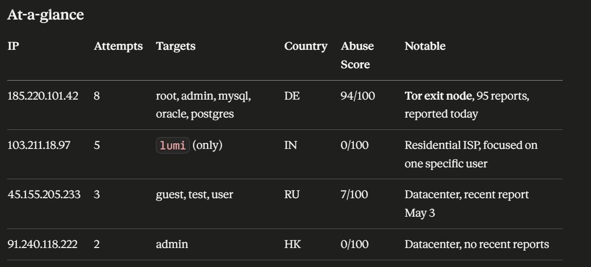
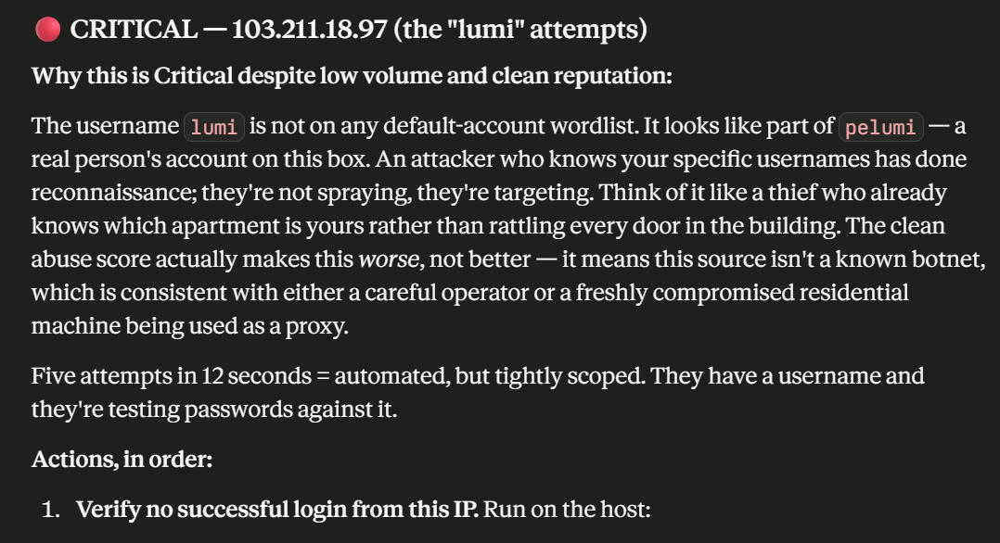
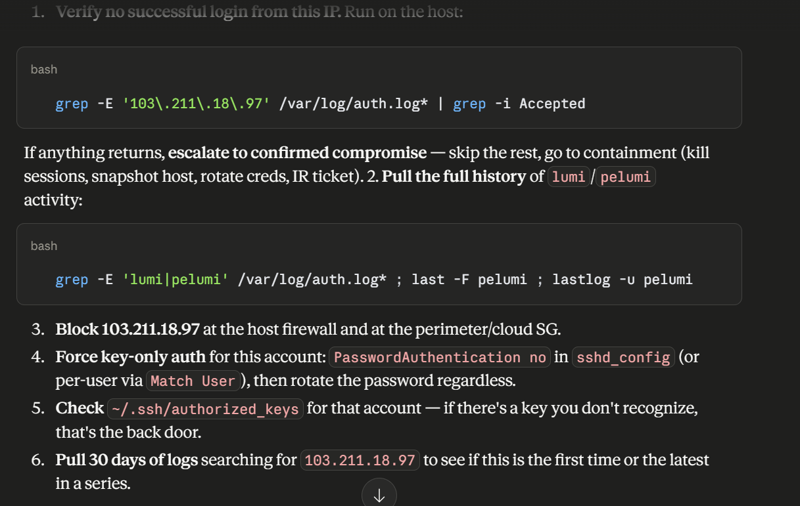
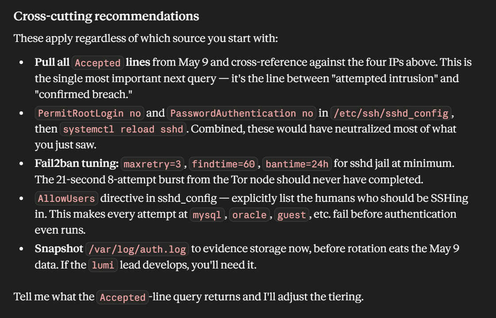

# MCP Security Tools

You know how every company gets thousands of "someone tried to log in"
alerts a day, and one or two people are supposed to sort through them?
This is a small project that shows what happens when you teach an AI
assistant to do the first pass for them — read the logs, spot what looks
off, check whether the suspicious bits are known troublemakers, and hand
back a prioritized summary. Built end-to-end, code public, demo video in
the README.

## Why this matters

Security teams everywhere face the same problem: more alerts than humans
can investigate. A medium-sized company can see tens of thousands of
security events per day with only one or two analysts available to triage
them. Most events never get a careful look.

The pattern shown here — an AI agent given a small set of trusted tools
and turned loose on first-pass investigation work — is what production
security platforms (Arctic Wolf, eSentire, PointClickCare, Field Effect,
and others) are building toward. The AI doesn't replace the analyst. It
handles the repetitive 90% so the human can spend their time on the 10%
that actually requires judgment.

The setup benefits any organization that:

- Generates more security alerts than it can manually review
- Wants to free up senior analyst time for the harder cases
- Needs broader coverage without proportionally expanding the team
- Has security data scattered across multiple tools that need cross-checking

Built as a portfolio piece for security analyst roles on agentic SOC
platforms.

---

## Demo
https://github.com/user-attachments/assets/c50b81d6-ce35-463e-bb9f-dd179128041e

The agent receives this prompt:

> *I'm investigating a possible incident on one of our Linux servers. The auth
> log is at sample_data/auth.log in the project folder. Please investigate the
> failed login activity, identify the most concerning sources, check their
> reputation, and give me a tiered triage report with recommended actions.
> Treat this as a real incident response — be specific.*

It autonomously calls `parse_auth_log` to extract failed-login patterns, then
calls `check_ip_reputation` once per suspicious source IP to enrich each one
against AbuseIPDB. The output:

**At-a-glance synthesis of log data + threat intelligence:**



**Critical-tier reasoning — agent identifies a likely credential compromise
pattern despite low IP volume:**




**Cross-cutting recommendations the agent generated unprompted:**



---

## What the tools do

### `parse_auth_log(filepath: str) -> dict`

Reads an SSH auth log file. Extracts every `Failed password` event using a
regex that captures the source IP and target username. Groups events by source
IP and returns the result sorted by attempt count descending — noisiest
attackers first. Each source gets first-seen and last-seen timestamps so the
agent can reason about attack timing.

### `check_ip_reputation(ip: str) -> dict`

Queries the AbuseIPDB v2 API for a given IPv4 address. Returns the abuse
confidence score (0–100), total abuse reports filed against the IP, country
code, ISP, usage type (data center / residential / etc.), whether it's a known
Tor exit node, and the last-reported timestamp. Defensive against API errors —
returns a clean error dict on auth failures, rate limits, network issues, or
malformed input rather than crashing the server.

The tools are designed to chain. Run `parse_auth_log` once to get suspicious
IPs, then run `check_ip_reputation` once per IP to enrich them. The agent
figures out the chaining without being told.

---

## Architecture

```
┌──────────────────────┐         MCP protocol          ┌─────────────────────────┐
│   Claude Desktop     │ ◄────── (stdio / JSON) ─────► │  server.py              │
│   (MCP client)       │                               │  FastMCP from MCP SDK   │
│                      │                               │                         │
│  - launches server   │   "what tools do you have?"   │  @mcp.tool()            │
│    as subprocess     │                               │  parse_auth_log()       │
│  - reads tool list   │   "call parse_auth_log..."    │                         │
│  - lets the AI       │                               │  @mcp.tool()            │
│    decide when to    │   "result: {...}"             │  check_ip_reputation()  │
│    call them         │                               │     │                   │
└──────────────────────┘                               └─────│───────────────────┘
                                                             │
                                                             ▼
                                                    ┌─────────────────────┐
                                                    │  AbuseIPDB API      │
                                                    │  (HTTPS + API key)  │
                                                    └─────────────────────┘
```

Claude (the agent) sits on the left. The server (the tools) sits on the right.
MCP is the protocol slot between them. AbuseIPDB is what one of the tools
reaches out to in the real world.

This is the same shape commercial agentic SOC platforms use — substitute Claude
with the platform's agent runtime, substitute the two tools with dozens of
production security integrations.

---

## Setup

### Prerequisites

- Python 3.12+ (tested on 3.14)
- An [AbuseIPDB account](https://www.abuseipdb.com/) and free-tier API key
  (1,000 checks/day at no cost)
- An MCP client. Tested with Claude Desktop. Should work with any compliant
  MCP client.

### Install

```bash
git clone https://github.com/plumi-cyber/mcp-security-tools.git
cd mcp-security-tools
python -m venv .venv
# Linux/macOS:
source .venv/bin/activate
# Windows PowerShell:
.\.venv\Scripts\Activate.ps1

pip install -r requirements.txt
```

### Configure your API key

Create a `.env` file in the project root:

```
ABUSEIPDB_API_KEY=your_actual_key_here
```

The `.gitignore` already excludes `.env` so the key never gets committed.

### Verify the tools work standalone

```bash
python
```

Then in the Python REPL:
```python
from server import parse_auth_log, check_ip_reputation
import json

# Parser test
result = parse_auth_log("sample_data/auth.log")
print(json.dumps(result, indent=2))
# Should return 18 failed attempts across 4 unique source IPs

# Reputation test
result = check_ip_reputation("185.220.101.42")
print(json.dumps(result, indent=2))
# Should return abuse_confidence_score near 100, is_tor: true
```

### Wire into Claude Desktop

Open Claude Desktop → Settings → Developer → **Edit Config**. Add the
`security-tools` server to your config:

```json
{
  "mcpServers": {
    "security-tools": {
      "command": "/absolute/path/to/.venv/bin/python",
      "args": ["/absolute/path/to/server.py"]
    }
  }
}
```

On Windows the paths need double-escaped backslashes:
```json
"command": "C:\\Users\\you\\projects\\mcp-security-tools\\.venv\\Scripts\\python.exe"
```

Restart Claude Desktop. In a new chat, click the **+** button → Connectors →
toggle `security-tools` on. Tools should appear in the agent's tool list.

### Run the demo

In Claude Desktop, paste the demo prompt:

> Use the parse_auth_log tool to read sample_data/auth.log (use the absolute
> path on your machine). Then for each suspicious source IP, use
> check_ip_reputation to enrich it. Produce a tiered triage report with
> recommended actions.

Approve each tool-call permission prompt. The agent will produce something
similar to the screenshots above.

---

## Project structure

```
mcp-security-tools/
├── server.py                  MCP server with both tools
├── requirements.txt           Python dependencies
├── sample_data/
│   └── auth.log              Hand-crafted SSH auth log with 5 attack patterns
├── screenshots/              Demo evidence + setup screenshots
├── .env.example              Template for the API key file
├── .gitignore                Excludes .env, .venv, __pycache__, etc.
├── BUILD_LOG.md              Working notebook from the build sessions
├── LICENSE                   MIT
└── README.md                 You are here
```

The sample auth log contains five deliberately-chosen attack patterns: an
aggressive Tor brute force, a username spray, a quiet probe, a likely
credential compromise (failures followed by success), and benign internal
traffic. The mix gives the agent enough material to produce tiered triage
rather than a flat "high count = bad" sort.

---

## Roadmap (v2)

These are intentional v1 scope decisions, not bugs:

- **`parse_auth_log` only returns failed events.** The agent currently has to
  ask the analyst whether suspicious IPs eventually succeeded. v2 either
  extends the parser with an `include_successes` flag, or splits it into a
  separate `find_successful_logins(ip)` tool. Both are defensible — production
  SOC platforms typically split the access patterns because failure logs and
  success logs have very different volumes and use cases.
- **AbuseIPDB only.** v2 adds VirusTotal and GreyNoise for cross-source
  enrichment. Different sources have different blind spots; analysts trust
  agreement across sources more than any single source's score.
- **No persistence.** Each invocation is stateless. v2 caches reputation
  lookups for 24h to avoid burning the API quota on repeated checks of the
  same IP within an investigation.
- **No write actions.** v2 could add a `submit_abuse_report(ip, reason)` tool
  that closes the loop on confirmed-bad IPs. Adding write actions to an
  agentic system raises a separate question — how to bound what the agent is
  allowed to do unattended — which is the right kind of question to be
  thinking about, not avoiding.

---

## Build history

For the working notebook covering the full build process — including the
challenges encountered (Microsoft Store sandbox path redirection, JSON config
syntax issues, working directory resolution) and how each was diagnosed and
solved — see [BUILD_LOG.md](BUILD_LOG.md).

---

## License

MIT. See [LICENSE](LICENSE).
